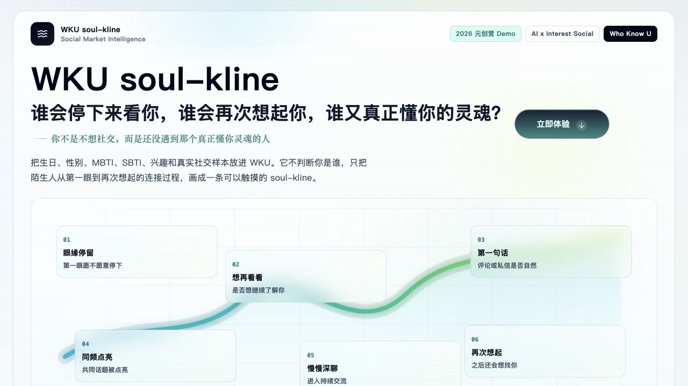

# WKU soul-kline

WKU soul-kline 是一个面向兴趣社交场景的 AI 连接行情 Demo。它把生日、性别、MBTI、SBTI、兴趣和真实社交样本，转译成一条可以交互查看的 `soul-kline`，帮助用户理解自己在社交平台里哪里更容易被看见、被接住、被再次想起。

项目定位是 **AI x Interest Social**：它不做命运预测，也不把用户定型，而是用多 Agent 协作生成一份可读、可解释、可继续调整的社交连接分析。



## 功能亮点

- **Who Know U**：单人连接分析，生成个人 soul-kline、社交表达建议、同频人群线索和安全边界提醒。
- **Who Know Us**：双人共振分析，生成两个人的共振 K 线、共同点、错频风险、聊天桥接话题和靠近建议。
- **多 Agent 协作**：画像建模、共鸣信号、soul-kline 生成、同频人群、表达方案、安全边界六个 Agent 并行工作。
- **流式生成体验**：后端通过 SSE 持续推送 Agent 状态、预览结果和最终结果，前端实时更新工作台。
- **可交互读盘**：鼠标 hover 查看节点详情，点击节点锁定或取消锁定读盘卡片。
- **OpenAI-compatible 接入**：支持 OpenAI、DeepSeek、Gemini 兼容接口等，只要服务提供 `/chat/completions` 兼容格式即可接入。

## 技术栈

- **前端**：React 19、TypeScript、Vite、React Router、GSAP、Lucide React
- **后端**：Node.js、Express、Server-Sent Events
- **构建**：Vite build、Rollup chunk split、Tailwind CSS
- **部署方式**：单 Node 服务同时托管 API 和 `dist` 静态文件

## 快速开始

### 1. 安装依赖

```bash
npm install
```

### 2. 配置环境变量

复制示例文件：

```bash
cp .env.example .env
```

填写自己的模型服务配置：

```bash
API_BASE_URL=https://api.openai.com/v1
API_KEY=your-api-key
DEFAULT_MODEL=gpt-4.1-mini
PORT=3000
```

如果使用 DeepSeek 或其它 OpenAI-compatible 服务，把 `API_BASE_URL` 和 `DEFAULT_MODEL` 改成对应服务提供的地址和模型名。

> 注意：不要把 `.env` 上传到 GitHub。仓库已经通过 `.gitignore` 忽略 `.env`、`server/.env`、`node_modules` 和 `dist`。

### 3. 本地开发

```bash
npm run dev
```

默认地址：

- 前端：`http://localhost:5173`
- 后端：`http://localhost:3000`
- 健康检查：`http://localhost:3000/api/health`

`vite.config.ts` 已经配置了 `/api` 代理，所以开发环境下前端可以直接请求 `/api/vibeline/analyze` 和 `/api/vibeline/match`。

## 常用命令

```bash
# 启动前后端开发服务
npm run dev

# 只启动前端
npm run dev:client

# 只启动后端
npm run dev:server

# 生成生产构建
npm run build

# 本地预览前端构建产物
npm run preview

# 生产模式启动 Express 服务
npm run start
```

## 接口说明

### `GET /api/health`

服务健康检查。

```bash
curl http://localhost:3000/api/health
```

### `POST /api/vibeline/analyze`

生成单人 Who Know U 分析。接口返回 SSE 流，前端会按事件类型实时更新 Agent 状态和结果。

主要事件：

- `progress`：阶段性进度文本
- `vibeline_preview`：兜底预览结果
- `agent_update`：单个 Agent 的运行状态
- `complete`：最终完整结果
- `error`：错误信息

### `POST /api/vibeline/match`

生成双人 Who Know Us 共振分析。返回格式同样是 SSE 流。

## 目录结构

```text
App.tsx                         # 应用路由入口
pages/VibeLinePage.tsx          # WKU soul-kline 主页面
components/VibeLineChart.tsx    # 可交互 soul-kline 曲线
services/vibelineService.ts     # 前端 SSE 调用封装
types/vibeline.ts               # 前后端共享的前端类型

server/index.js                 # Express 入口，同时托管 API 和 dist
server/modelConfig.js           # OpenAI-compatible 模型配置
server/vibelineAnalyzer.js      # Who Know U 多 Agent 分析
server/vibelineMatchAnalyzer.js # Who Know Us 多 Agent 分析
server/vibelinePrompts.js       # soul-kline Agent 提示词
server/vibelineEngine.js        # 输入清洗、兜底结构与结果合并

docs/images/                    # README 和文档截图
tests/                          # 核心逻辑测试
```

## 生产部署

这个项目生产环境只需要一个 Node 服务：先构建前端到 `dist`，再由 `server/index.js` 托管静态文件和 API。

### 方式一：服务器手动部署

适合阿里云 ECS、轻量应用服务器、腾讯云 CVM、普通 VPS。

```bash
git clone https://github.com/gaweek/wku-soul-kline.git
cd wku-soul-kline

npm ci
cp .env.example .env
nano .env

npm run build
NODE_ENV=production PORT=3000 npm run start
```

推荐用 PM2 常驻运行：

```bash
npm install -g pm2
pm2 start "npm run start" --name wku-soul-kline
pm2 save
pm2 startup
```

### Nginx 反向代理示例

```nginx
server {
    listen 80;
    server_name your-domain.com;

    location / {
        proxy_pass http://127.0.0.1:3000;
        proxy_http_version 1.1;
        proxy_set_header Host $host;
        proxy_set_header X-Real-IP $remote_addr;
        proxy_set_header X-Forwarded-For $proxy_add_x_forwarded_for;
        proxy_set_header X-Forwarded-Proto $scheme;
    }

    location /api/ {
        proxy_pass http://127.0.0.1:3000;
        proxy_http_version 1.1;
        proxy_buffering off;
        proxy_cache off;
        proxy_read_timeout 300s;
        proxy_connect_timeout 75s;
        proxy_set_header Host $host;
        proxy_set_header X-Real-IP $remote_addr;
        proxy_set_header X-Forwarded-For $proxy_add_x_forwarded_for;
        proxy_set_header X-Forwarded-Proto $scheme;
    }
}
```

`/api/` 使用 SSE 流式返回，Nginx 里需要关闭 buffering，否则前端可能无法实时看到 Agent 进度。

### 方式二：PaaS 部署

适合 Render、Railway、Fly.io 等平台。

```text
Build command: npm ci && npm run build
Start command: npm run start
Node version: 20 或 22
Environment: API_BASE_URL, API_KEY, DEFAULT_MODEL, PORT
```

## 阿里云部署建议

最低可用配置：

```text
系统：Ubuntu 22.04 / 24.04
规格：2 核 2G 起步，2 核 4G 更稳
磁盘：40GB
安全组：开放 22、80、443
运行方式：Node.js + PM2 + Nginx
```

部署顺序：

1. 创建 ECS 或轻量应用服务器。
2. 安装 `git`、`nodejs`、`npm`、`nginx`。
3. 从 GitHub 拉取项目。
4. 在服务器创建 `.env` 并填写真实 `API_KEY`。
5. 执行 `npm ci && npm run build`。
6. 使用 PM2 启动 `npm run start`。
7. 使用 Nginx 反向代理到 `127.0.0.1:3000`。
8. 绑定域名后配置 HTTPS。

如果服务器地域在中国内地，域名正式访问通常需要完成 ICP 备案。没有备案前可以先用公网 IP 测试。

## 更新线上版本

完整迭代流程见：[docs/ITERATION-WORKFLOW.md](docs/ITERATION-WORKFLOW.md)。

本地提交并推送：

```bash
git add .
git commit -m "Update WKU soul-kline"
git push
```

服务器更新：

```bash
cd /var/www/wku-soul-kline
git pull
npm ci
npm run build
pm2 restart wku-soul-kline
```

## 安全注意事项

- 不要提交 `.env`、API Key、私钥、证书文件。
- 生产环境建议只在内网监听 Node 服务，通过 Nginx 暴露 `80/443`。
- 模型接口调用失败时，项目会返回兜底结构，方便前端保持可用体验。
- 如果把仓库改为 public，先重新检查历史提交里是否出现过密钥。

## License

Apache-2.0
