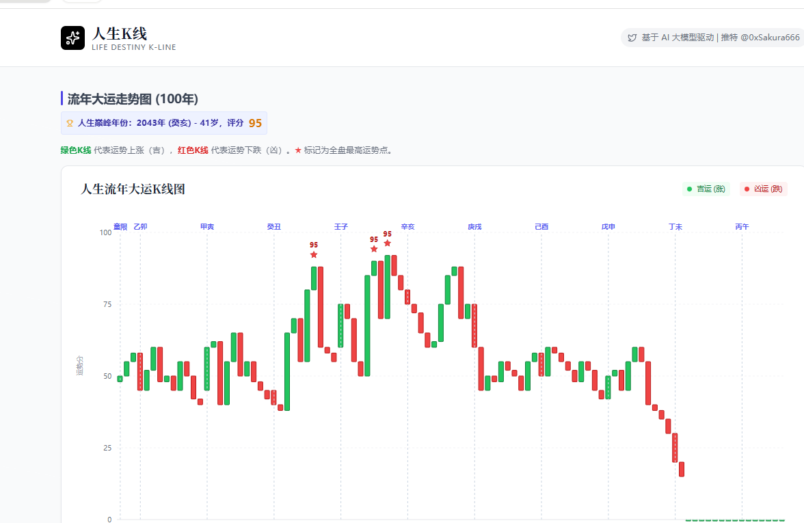
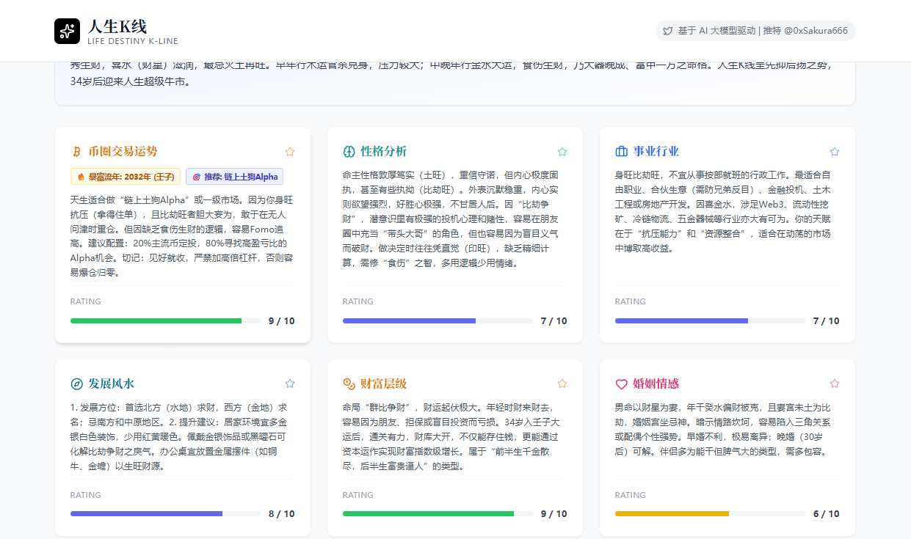

<p align="center">
  
</p>

<h1 align="center">人生 K 线 | Life Destiny K-Line</h1>

<p align="center">
  <strong>将命运可视化，用 K 线读懂人生</strong>
</p>

<p align="center">
  <a href="https://github.com/miounet11/life-kline/blob/main/LICENSE">
    
  </a>
  <a href="https://github.com/miounet11/life-kline/stargazers">
    
  </a>
  <a href="https://github.com/miounet11/life-kline/issues">
    
  </a>
  <a href="https://www.life-kline.com">
    
  </a>
</p>

<p align="center">
  基于 AI 大模型 + 传统八字命理，以金融 K 线图的形式展现人生运势轨迹
</p>

<p align="center">
  <a href="#-在线体验">在线体验</a> •
  <a href="#-产品理念">产品理念</a> •
  <a href="#-功能特点">功能特点</a> •
  <a href="#-快速开始">快速开始</a> •
  <a href="#-项目架构">项目架构</a> •
  <a href="#-贡献指南">贡献</a>
</p>

---

## 🌐 在线体验

<p align="center">
  <a href="https://www.life-kline.com">
    
  </a>
</p>

**无需注册，无需配置，打开即用：**

### 👉 [https://www.life-kline.com](https://www.life-kline.com)

> 本开源项目是 life-kline.com 的完整源码，你可以直接在线体验所有功能，也可以 fork 本项目进行二次开发。

---

## 📸 产品预览

<table>
  <tr>
    <td></td>
    <td></td>
  </tr>
  <tr>
    <td align="center"><em>人生流年大运 K 线走势图</em></td>
    <td align="center"><em>AI 深度命理分析报告</em></td>
  </tr>
</table>

---

## 💡 产品理念

> **"像看股票一样看人生"**

我们将传统命理学与现代数据可视化相结合，创造了一种全新的人生运势解读方式：

| 传统命理 | 人生 K 线 |
|---------|----------|
| 晦涩难懂的术语 | 直观的图表展示 |
| 主观的文字描述 | 量化的运势评分 |
| 单一维度分析 | 多维度综合评估 |
| 依赖人工解读 | AI 智能深度分析 |

**核心价值：**
- **降低门槛** - 无需懂命理，看图即懂运势
- **数据驱动** - 将抽象运势转化为可视化数据
- **AI 赋能** - 大模型深度分析，专业级解读
- **古今融合** - 传统智慧与现代技术的完美结合

---

## ✨ 功能特点

### 智能八字排盘
- 输入出生时间地点，自动精准排盘
- 真太阳时自动修正（基于经度计算）
- 大运流年自动推算
- 基于 `lunar-javascript` 精确计算

### K 线可视化
- 1-100 岁人生运势 K 线图
- 大运、流年双轨展示
- 类似股票的 OHLC 图表
- 人生"牛市""熊市"一目了然

### AI 深度分析
- 性格特质与天赋分析
- 事业财运发展趋势
- 婚姻感情运势预测
- 健康风险提示
- 发展方位风水建议

### Web3 特供
- 加密货币交易运势
- 暴富流年预测
- 交易风格建议
- 行业适配分析

### 名人案例库
- 收录知名人士的人生 K 线
- 对比学习，找到相似命盘
- 了解不同命运的实际走势

### 隐私与安全
- 支持本地部署，数据自主可控
- 无需上传敏感信息到第三方
- 开源代码可审计

---

## 🚀 快速开始

### 两种使用模式

#### 模式一：云服务模式（推荐）

**无需任何配置，直接使用官方服务：**

👉 访问 [https://www.life-kline.com](https://www.life-kline.com)

- **优点**：零配置，即开即用，无需维护
- **适合人群**：普通用户，快速体验者

---

#### 模式二：自托管模式

**使用自己的 AI API，完全掌控数据和成本：**

##### 环境要求
- Node.js 18+
- npm / pnpm / yarn

##### 安装步骤

```bash
# 1. 克隆项目
git clone https://github.com/miounet11/life-kline.git
cd life-kline

# 2. 安装依赖
npm install

# 3. 配置环境变量
cp .env.example .env

# 编辑 .env 文件，配置你的 API
# API_BASE_URL=https://api.openai.com/v1
# API_KEY=sk-your-api-key-here
# DEFAULT_MODEL=gpt-4

# 4. 启动服务（前后端同时启动）
npm run dev
```

访问 http://localhost:5173 开始使用。

##### 环境变量配置

```bash
# API 配置（必填）
API_BASE_URL=https://api.openai.com/v1  # API 服务地址
API_KEY=sk-xxx                           # 你的 API Key
DEFAULT_MODEL=gpt-4                      # 默认模型

# 服务器配置
PORT=3000                                # 后端端口
JWT_SECRET=random-32-char-string         # JWT 密钥

# 积分系统配置（可自定义）
FREE_INIT_POINTS=1000                    # 新用户初始积分
COST_PER_ANALYSIS=50                     # 每次分析消耗积分

# 管理员配置
ADMIN_VOUCHER_PASSWORD=secure-password   # 兑换券管理密码

# 邮件配置（可选）
# MAIL_SMTP_HOST=smtp.example.com
# MAIL_SMTP_PORT=587
# MAIL_FROM=noreply@example.com
# MAIL_PASSWORD=your-password
```

##### 支持的 AI 模型

本项目兼容任何 OpenAI API 格式的服务：

- OpenAI GPT-4 / GPT-4o / GPT-3.5
- Anthropic Claude (通过兼容接口)
- Google Gemini (通过兼容接口)
- 国内各类中转 API（如 Cloudflare AI Gateway）
- 本地模型（如 LM Studio、Ollama 等）

---

### 💰 定价系统自定义

自托管模式下，你可以完全自定义积分和定价规则：

1. **修改初始积分**：编辑 `.env` 中的 `FREE_INIT_POINTS`
2. **调整消费规则**：编辑 `.env` 中的 `COST_PER_ANALYSIS`
3. **发放兑换券**：使用管理员密码生成兑换码

**示例场景：**
- **企业内部使用**：设置超高初始积分，或取消积分限制
- **教育机构**：为学生批量发放兑换券
- **付费服务**：对接支付网关，实现积分充值

---

## 🏗️ 项目架构

### 技术栈

| 层级 | 技术 | 说明 |
|-----|------|------|
| **前端框架** | React 19 + Vite | 最新 React，极速 HMR |
| **UI 样式** | TailwindCSS | 原子化 CSS，高效开发 |
| **图表** | Recharts | 专业金融图表库 |
| **动画** | Framer Motion | 流畅交互动效 |
| **路由** | React Router 7 | 声明式路由 |
| **后端** | Express.js | 轻量高效 |
| **数据库** | SQLite (better-sqlite3) | 零配置，本地优先 |
| **认证** | JWT + bcrypt | 安全可靠 |
| **八字算法** | lunar-javascript | 精确农历/干支计算 |
| **AI 接口** | OpenAI 兼容 | 支持多种大模型 |

### 目录结构

```
life-kline/
├── 📱 前端 (React 19 + Vite)
│   ├── pages/                    # 页面组件
│   │   ├── HomePage.tsx          # 首页 - K线生成
│   │   ├── DashboardPage.tsx     # 仪表盘
│   │   ├── DailyFortunePage.tsx  # 每日运势
│   │   ├── CasesLibrary.tsx      # 名人案例库
│   │   ├── KnowledgeHub.tsx      # 知识中心
│   │   └── ProfilePage.tsx       # 个人档案
│   │
│   ├── components/               # 可复用组件
│   │   ├── layout/               # 布局组件
│   │   ├── chart/                # 图表组件
│   │   ├── fortune/              # 运势组件
│   │   ├── celebrity/            # 名人案例组件
│   │   ├── profile/              # 档案管理组件
│   │   └── share/                # 分享海报组件
│   │
│   ├── services/                 # 前端服务
│   │   ├── fortuneCalculator.ts  # 运势计算引擎
│   │   ├── baziSimilarityService.ts # 八字相似度计算
│   │   └── calendarExport.ts     # 日历导出
│   │
│   └── contexts/                 # React Context
│
├── 🖥️ 后端 (Node.js + Express)
│   └── server/
│       ├── index.js              # 主入口 & API 路由
│       ├── database.js           # SQLite 数据库
│       ├── auth.js               # JWT 认证
│       ├── baziCalculator.js     # 八字计算核心
│       ├── unifiedAnalyzer.js    # 统一 AI 分析引擎
│       ├── agentPrompts.js       # AI Agent 提示词库
│       ├── emailService.js       # 邮件服务
│       ├── pointsManager.js      # 积分管理
│       └── cacheManager.js       # 缓存管理
│
└── 📜 脚本 (scripts/)
    ├── seed-knowledge.js         # 知识内容种子数据
    └── seed-cases.js             # 名人案例种子数据
```

### 核心工作流程

```
用户输入出生信息
       ↓
┌──────────────────┐
│  智能八字排盘    │  ← lunar-javascript 精确计算
│  (真太阳时修正)  │
└────────┬─────────┘
         ↓
┌──────────────────┐
│  AI 统一分析引擎 │  ← 大模型 (GPT/Claude/Gemini)
│  • 核心命理      │
│  • 事业财富      │
│  • 婚姻健康      │
│  • 历史K线       │
│  • 未来预测      │
│  • Web3运势      │
└────────┬─────────┘
         ↓
┌──────────────────┐
│   K线图 + 报告   │  ← Recharts 可视化
│   + 分享海报     │
└──────────────────┘
```

---

## 📚 文档

- [贡献指南](CONTRIBUTING.md)
- [行为准则](CODE_OF_CONDUCT.md)
- [安全政策](SECURITY.md)
- [架构文档](docs/ARCHITECTURE-SIMPLIFICATION.md)
- [API 文档](docs/API-UNIFIED-ANALYZER.md)

---

## 🤝 贡献指南

我们欢迎所有形式的贡献！无论是报告 bug、提出新功能建议，还是提交代码改进。

### 如何贡献

1. Fork 本仓库
2. 创建你的特性分支 (`git checkout -b feature/AmazingFeature`)
3. 提交你的修改 (`git commit -m 'Add some AmazingFeature'`)
4. 推送到分支 (`git push origin feature/AmazingFeature`)
5. 开启一个 Pull Request

详细信息请查看 [CONTRIBUTING.md](CONTRIBUTING.md)

---

## 🐛 问题反馈

如果你发现了 bug 或有功能建议：

1. 先在 [Issues](https://github.com/miounet11/life-kline/issues) 中搜索是否已有相关问题
2. 如果没有，请创建新的 Issue，并详细描述问题或建议
3. 对于安全问题，请查看 [SECURITY.md](SECURITY.md) 了解如何私密报告

---

## 📄 开源协议

本项目采用 [Apache License 2.0](LICENSE) 协议开源。

**这意味着你可以：**
- 自由使用、修改、分发本软件
- 用于商业目的
- 修改并闭源（但需保留版权声明）

**前提是：**
- 保留原作者的版权声明
- 说明你做了哪些修改
- 提供 Apache 2.0 协议的副本

---

## 🙏 致谢

感谢以下开源项目：

- [lunar-javascript](https://github.com/6tail/lunar-javascript) - 精确的农历和八字计算库
- [React](https://react.dev/) - 构建用户界面的 JavaScript 库
- [Recharts](https://recharts.org/) - 专业的 React 图表库
- [TailwindCSS](https://tailwindcss.com/) - 现代化的 CSS 框架
- [Vite](https://vitejs.dev/) - 下一代前端构建工具

以及所有贡献者的支持！

---

## ⚠️ 免责声明

本项目仅供娱乐与文化研究，命运掌握在自己手中，请理性看待分析结果。

**特别提示：**
- 本软件不提供任何形式的人生建议或决策依据
- AI 分析结果仅供参考，不构成专业咨询
- 请勿过度依赖算命结果做出重大人生决定
- 投资有风险，Web3 运势分析不构成投资建议

---

<p align="center">
  <strong>⭐ 如果觉得有趣，欢迎 Star 支持！</strong>
</p>

<p align="center">
  Made with ❤️ by the Life-Kline Team
</p>

<p align="center">
  <a href="https://www.life-kline.com">官网</a> •
  <a href="https://github.com/miounet11/life-kline">GitHub</a> •
  <a href="https://github.com/miounet11/life-kline/issues">问题反馈</a>
</p>
